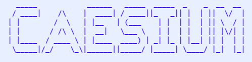
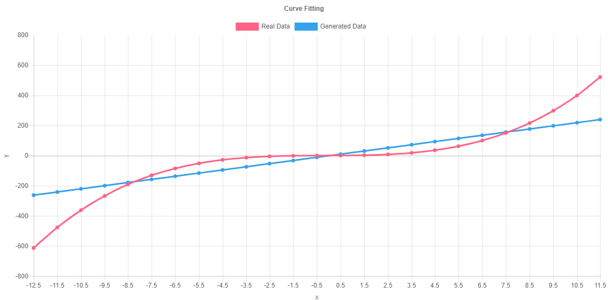
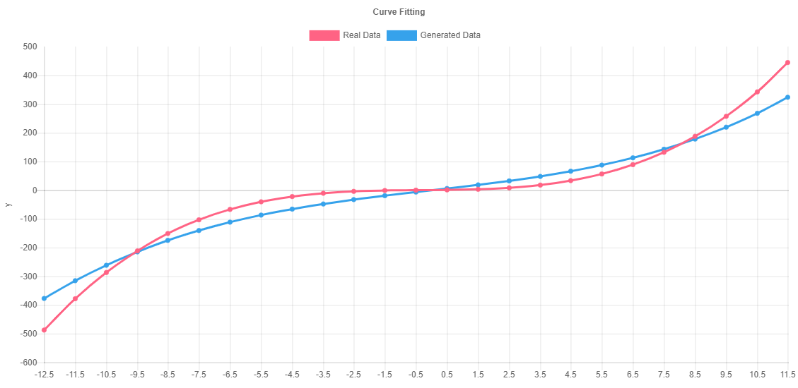
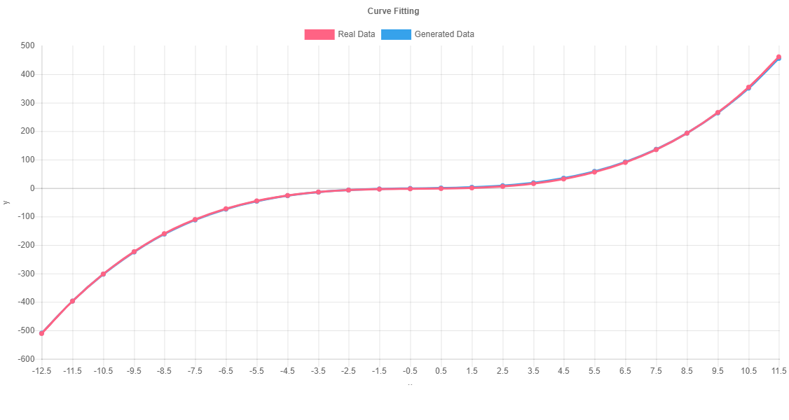
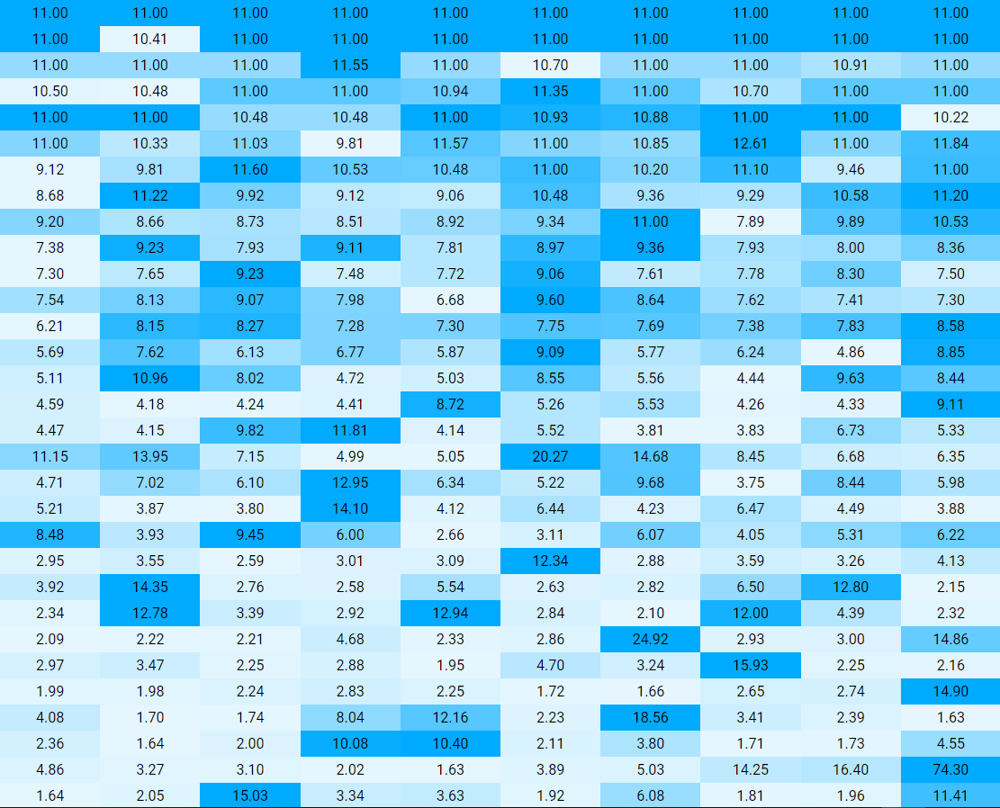

# Caesium

An evolutionary neural network implementation, inspired by [Neuroevolution of Augmenting Topologies](http://nn.cs.utexas.edu/downloads/papers/stanley.ec02.pdf). The Caesium library is currently available for JavaScript. Python and Node.js implementations are planned.

# Design

## Architecture

The neural network architecture used for Caesium deviates substantially from that of a traditional neural network.

For one, there are no "weights" used in the synapses. This is perhaps the most integral part of a neural network, and the one that most closely mimics a biological neural network. Caesium's goal is not to imitate biological neural networks, but to take advantage of the unique abilities of computational processing to create a new kind of data model.

Caesium aims to create as basic as possible a framework for the evolutionary optimization strategy to build a model with. At the highest level, this is reflected by Caesium's NEAT architecture, which uses individual nodes and connections to represent the flow of data, instead of linear stacks of "layers".

### Operations

Caesium uses basic operations performed on data to represent its computations, instead of a traditional model with weights, biases, activation functions, and other properties of traditional neural networks. Operations are completed in nodes, and there are currently two types: addition and multiplication. Both nodes can have an infinite number of inputs and an infinite number of outputs. The addition node takes several scalar values as input and returns the sum of all these values as its output. The multiplication node returns the product of all of its inputs.


A more basic representation of operations performed on data allows for more flexible, versatile models.

### Data


### Delays

The flow of data through neural networks in Caesium is regulated by delays, stored in the connections between nodes.

## Evaluation

The value of each node is evaluated simultaneously based on a buffer of the stored values of each node. Similarly to a biological neural network, the entire network is constantly being updated and re-evaluated, as opposed to a traditional model, in which each layer would be evaluated sequentially, until the output layer is calculated. This would not be feasible for the organic style of Caesium's networks, in which input and output nodes are spread throughout the network. Constant evaluation also allows for the network to constantly "think" about problems that may require more than one computational iteration to solve, and allows the network to recursively apply dynamic mathematical operations and functions on data to iteratively transform it.

For example, instead of stacking several multiplication nodes together to approximate an exponent function, the network could develop a "multiplication loop" that multiplies the result of a computation by another number, then repeats this operation on the output of the function until another signal tells the network to end the loop and send the output to the global output node, theoretically allowing for more efficiency and smaller networks.

## Evolutionary Development of Models

### Training

### Limits

A hard limit can be placed on the number of nodes and/or connections that the neuroevolution algorithm can add to the network. This prevents the network growing indefinitely in size and reduces memory usage. It also encourages the evolution-based optimization algorithm to find better solutions to problems with fewer nodes, therefore reducing overfitting and improving generalization.

# Implementations

This is a technical guide to specific aspects of the Caesium library implementation in different programming languages for development reference purposes. Full documentation will be created soon.

## [JavaScript](docs/javascript/js.md)

## Python

A [Python implementation](https://github.com/generic-github-user/Caesium/issues/2) of Caesium is planned.

## Node.js

A [Node.js implementation](https://github.com/generic-github-user/Caesium/issues/97) of Caesium is planned.

# Credits

This project wouldn't have been possible without lots of great open-source technology that people have been kind enough to share with the world. All sources listed here are also credited in code comments.

## Libraries

### Material Design Lite
*[getmdl.io](https://getmdl.io/)*

### Material Design Icons
*[material.io/tools/icons](https://material.io/tools/icons/?style=baseline)*

## Code Snippets

Smaller functions and pieces of code.

### UUID Generation Function
*[stackoverflow.com/a/105074](https://stackoverflow.com/a/105074)*

```javascript
var uuids = [];
const UUID = function () {
      // Generate a random string of four hexadecimal digits
      function s4() {
            return Math.floor((1 + Math.random()) * 0x10000)
            .toString(16)
            .substring(1);
      }
      // Generate UUID from substrings
      var id;
      do {
            id = s4() + s4() + "-" + s4() + "-" + s4() + "-" + s4() + "-" + s4() + s4() + s4();
      }
      while (uuids.indexOf(id) !== -1)

      uuids.push(id);
      return id;
}
```

### Range Mapping Function
*[stackoverflow.com/a/23202637](https://stackoverflow.com/a/23202637)*

```javascript
const map = function (num, in_min, in_max, out_min, out_max) {
      return (num - in_min) * (out_max - out_min) / (in_max - in_min) + out_min;
}
```

### Hexadecimal Brightness Function
*[stackoverflow.com/a/13542669](https://stackoverflow.com/a/13542669)*

```javascript
const shade_color = function (color, percent) {
    var f=parseInt(color.slice(1),16),t=percent<0?0:255,p=percent<0?percent*-1:percent,R=f>>16,G=f>>8&0x00FF,B=f&0x0000FF;
    return "#"+(0x1000000+(Math.round((t-R)*p)+R)*0x10000+(Math.round((t-G)*p)+G)*0x100+(Math.round((t-B)*p)+B)).toString(16).slice(1);
}
```

### Finding maximum value in array by property
*[stackoverflow.com/a/4020842](https://stackoverflow.com/a/4020842)*

```javascript
var min = Math.min.apply(Math, this.nodes.map(function(x) { return x.value; }));
var max = Math.max.apply(Math, this.nodes.map(function(x) { return x.value; }));
```

## Demos

A series of demos to show just how cool Caesium is and what it is capable of. Feel free to clone any demo and create a new project out of it.

### [Basic Demo](https://generic-github-user.github.io/Caesium/src/versions/javascript/projects/basic-demo/)
Literally just an HTML page with the Caesium library loaded. Have fun.

[](https://generic-github-user.github.io/Caesium/src/versions/javascript/projects/basic-demo/)

### [Network Visualization](https://generic-github-user.github.io/Caesium/src/versions/javascript/projects/network-visualization/)
Visualize all the nodes and connections in a Caesium network.

### [Curve Fitting](https://generic-github-user.github.io/Caesium/src/versions/javascript/projects/curve-fitting/)
Approximate a polynomial function using neuroevolution.

[](generic-github-user.github.io/Caesium/src/versions/javascript/projects/curve-fitting/)

[](generic-github-user.github.io/Caesium/src/versions/javascript/projects/curve-fitting/)

[](generic-github-user.github.io/Caesium/src/versions/javascript/projects/curve-fitting/)

### [Neuroevolution](https://generic-github-user.github.io/Caesium/src/versions/javascript/projects/neuroevolution/)
Evolve a randomly generated population of neural networks.

[](https://generic-github-user.github.io/Caesium/src/versions/javascript/projects/neuroevolution/)

### [2D Classification](https://generic-github-user.github.io/Caesium/src/versions/javascript/projects/2d-classification/)
Learn to classify 2D points based on their X and Y coordinates.
WARNING: Flashing colors

## Resources

Media and images used in Caesium.

### Transparent Textures
*[transparenttextures.com](https://www.transparenttextures.com/)*

Used for backgrounds in the JavaScript/web version of Caesium.

#### Brushed alum
*[transparenttextures.com/patterns/brushed-alum.png](https://www.transparenttextures.com/patterns/brushed-alum.png)*

*By [Tim Ward](http://www.mentalwarddesign.com/)*

Used for the network visualization background.

#### Az Subtle
*[transparenttextures.com/patterns/az-subtle.png](https://www.transparenttextures.com/patterns/az-subtle.png)*

*By [Anli.](https://azmind.com/)*

Used for the control panel/sidebar background.

### Logos

#### GitHub Logo
*[github.com/logos](https://github.com/logos)*

## Other

### Eric Meyer’s “Reset CSS” 2.0
*[cssreset.com/scripts/eric-meyer-reset-css](https://cssreset.com/scripts/eric-meyer-reset-css/)*

Used to reset the default CSS rules to make development a lot easier.

### ASCII Text Art Creator
*[www.network-science.de/ascii](http://www.network-science.de/ascii/)*

Used to create the ASCII logo art displayed in the console. See issue #20.
