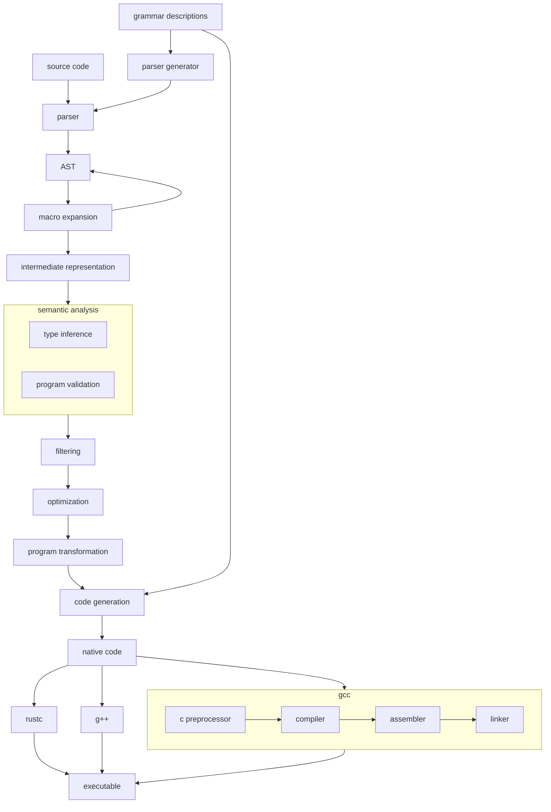

# C, etc. Compiler Extension Infrastructure Project

This is a currently unnamed project that aims to provide reusable, modular
components for extending the syntax and semantics of C-like programming
languages via macros (source code transformations), metaprogramming and
static/dynamic analysis libraries & toolkits, and other composable units in
order to permit extreme, Lisp-style language customization while retaining
ideal performance and compatability characteristics. The intended end result is
that you can shape your language and its tooling to function exactly how you
want them to while incurring minimal performance overhead at runtime or
decreased maintainability. Furthermore, seamless transpilation enables you to
experiment with different programming paradigms and language-level refactoring,
and to work on existing codebases in a way that works well for you. It should
go without saying that this project is in the *very* early stages of
development, and is not yet fit for any real-world application; nevertheless, I
encourage anyone who is interested to download and play with the components I
have built so far.

In terms of development philosophy, the main difference between this project
and most of my other programming language adjacent projects is that it aims to
work with existing systems in new and interesting ways rather than replacing
them entirely. In this way it is quite similar to Carbon or Zig: it becomes
trivial to work with legacy code without knowing how it was implemented because
the toolset can act as a bridge between the semantics and implementations of
code written in each language. It is also designed for developers who possess a
reasonable level of familiarity with the design and architecture of computer
systems (particularly compilers, the memory model, and the semantics of
programming languages) and want to interact with them via powerful abstractions
(sophisticated type systems, metaprogramming tools, etc.) instead of completely
hiding low-level details (removing the "sharp edges", so to speak).

This diagram summarizes the role of the framework in the preprocessing,
compilation, and build processes:

