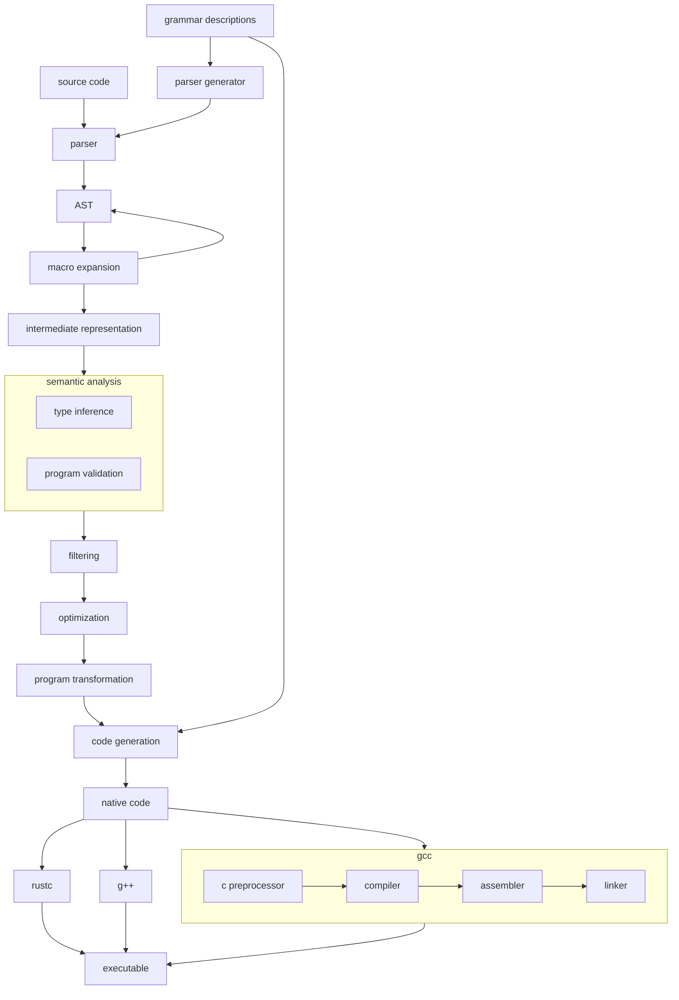

# C, etc. Compiler Extension Infrastructure Project

This is a currently unnamed project that aims to provide reusable, modular
components for extending the syntax and semantics of C-like programming
languages via macros (source code transformations), metaprogramming and
static/dynamic analysis libraries & toolkits, and other composable units in
order to permit extreme, Lisp-style language customization while retaining
ideal performance and compatability characteristics. The intended end result is
that you can shape your language and its tooling to function exactly how you
want them to while incurring minimal performance overhead at runtime or
decreased maintainability. Furthermore, seamless transpilation enables you to
experiment with different programming paradigms and language-level refactoring,
and to work on existing codebases in a way that works well for you. It should
go without saying that this project is in the *very* early stages of
development, and is not yet fit for any real-world application; nevertheless, I
encourage anyone who is interested to download and play with the components I
have built so far.

In terms of development philosophy, the main difference between this project
and most of my other programming language adjacent projects is that it aims to
work with existing systems in new and interesting ways rather than replacing
them entirely. In this way it is quite similar to Carbon or Zig: it becomes
trivial to work with legacy code without knowing how it was implemented because
the toolset can act as a bridge between the semantics and implementations of
code written in each language. It is also designed for developers who possess a
reasonable level of familiarity with the design and architecture of computer
systems (particularly compilers, the memory model, and the semantics of
programming languages) and want to interact with them via powerful abstractions
(sophisticated type systems, metaprogramming tools, etc.) instead of completely
hiding low-level details (removing the "sharp edges", so to speak).

A concrete example to help illustrate my point: in C, the canonical way to
iterate over a range of integers is using a for loop (in C++, there are
libraries like Boost, but a simple loop is still often the cleanest and most
concise way, especially if you want to avoid introducing dependencies). In
Finch (much like in Rust) we can use the built-in `range` function, which
depends on the `Iterator` and `Number` types and their associated
implementations; they are fairly lightweight, but must still be compiled or
interpreted alongside the original code (which might only need them once!). If
we want to transpile to human-readable code, the implementations of these types
and any relevant functions defined on them (which can be more numerous than one
might expect) also need to be included in the output.

In contrast, this project (name TBD) provides a `range` "filter" (this concept
is still a WIP and might be replaced as the project matures; it is basically
equivalent to a "global macro" that operates on the relevant parts of the
annotated syntax tree in order to bring the entire program "closer" to a native
representation that a program like gcc or rustc, or another filter, can handle)
whose behavior can be modified depending on what other filters are used in
compilation and several flags/options (or heuristics that stand in for them).
It augments the grammar of the target language with a new operator, `..`, which
is replaced with a call to `range<uint>` (or another integer type) during tree
shaping/IR generation (incidentally, there is a meta-filter planned that maps
operator construction filters to equivalent ones that use different syntax, so
that one could do something along the lines of `(1 to 42).map(...)`). The
parser will accept any two expressions as arguments to this operator (or its
associated function, `range`), and the semantic analyzer will attempt to verify
(in broad terms) that there is a way to make sense of the operation based on
the types of the inputs (my approach is based on Rust-like traits or abstract
interfaces which types can "implement" or "provide" to the user, but I aim for
it to be more general than this description might indicate). If we want to use
advanced iterator features and higher-order functions on the generated range
(and we don't mind having some light dependencies), it makes sense to include
the `Iterator` trait. Otherwise, the compiler can automatically select the
relevant C construct (since we're using a simple int type) and inline the
pre-translated bodies of whatever components we need.

This diagram summarizes the role of the framework in the preprocessing,
compilation, and build processes:

