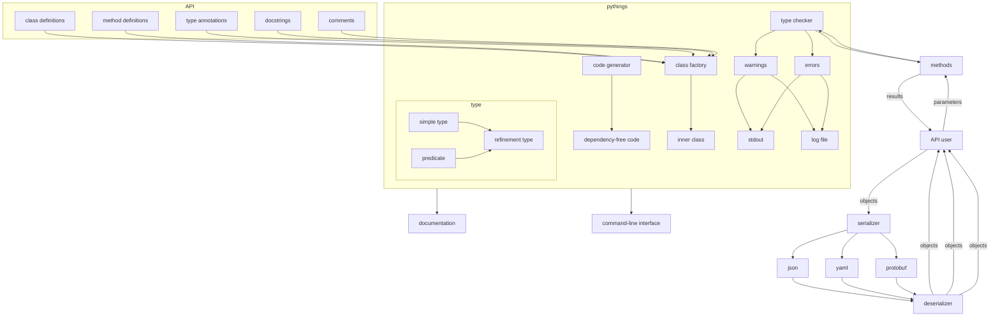

# pythings

This is a small module resurrecting some old experiments of mine taking
advantage of Python's highly dynamic runtime, namely to bridge the gaps between
code written for functionality, testing, and documentation. Python's semantics
enable quite extensive metaprogramming capabilities without necessarily
resorting to syntactic macros; the language also has many tools that permit us
to extract useful information embedded in code without needing a separate
parsing tool.

## Contents

- [pythings](#pythings)
  * [Contents](#contents)
  * [Features](#features)
  * [Installation](#installation)
  * [Usage](#usage)
  * [Purpose](#purpose)
  * [Technical Details](#technical-details)
  * [Project Structure](#project-structure)
  * [Branches](#branches)
  * [Stats](#stats)
  * [Tree](#tree)

## Features

- Documentation generation
- Test generation
- Example generation
- Type checking
- Serialization and deserialization
- Logging and error handling
- Boilerplate code generation/replacement
- Command-line interface construction

## Installation

Clone this repository (or the parts you need) and follow the instructions in
`#usage`.

## Usage

Import the components you need, add the appropriate decorators, and annotate
the types of the attributes and methods you want `pythings` to process. A
(relatively) simple example follows.

```py
from pythings import Class, Attr, Number

@Class
class Point:
    """A simple point in two-dimensional Euclidean space; can also be used to
    represent a vector."""

    x: Number = Attr("x-coordinate of point")
    y: Number = Attr("y-coordinate of point")
```

Generating documentation is then quite simple:

```py
Point.doc('markdown')
```

Or:

```py
Point.doc('html')
```

We can initialize `Point` instances like we would for any other class:

```
p = Point(7, 10)
print(p)
```

... and serialize to various formats:

```
p.to_json()
```

```
p.to_yaml()
```

## Purpose

The core feature this tool was designed around is the idea of a refinement
type, which combines an abstract type with a predicate function that dictates
the values an element of that type may have. More specifically, it is often
useful to describe valid arguments to a function, data members of a class/type,
possible function outputs (return values), etc. In practice, I often find
myself creating partial class templates or makeshift components that check
input types and generate documentation from type signatures and other
annotations.

To justify the cost of integrating a new system, most (if not all) of the tools
and features that would otherwise be provided by specialized components must be
usable. For me (and likely many others as well), this includes at least the
following:

- Logging and errors
- Unit test generation and randomized testing/fuzzing
- Automated generation of (some) examples for documentation
- Automatic construction of diagrams and other auxiliary material
- Documentation generation (multiple formats, high flexibility)
- Serialization/deserialization
- Templating or fully automated generation of boilerplate code and derivable
methods/properties
- Code generation (module should be able to disappear WRT production code where
possible, i.e. less dynamic attributes that can be determined prior to the
"actual" runtime)
- Semi-automated implementation of intuitive command-line interfaces

## Technical Details

Thus, the goal here is to create a generic helper class that others can extend
and which integrates (potentially sophisticated) type information to
automatically perform runtime type checking for arguments and other values when
appropriate, generate relevant unit tests, and build formatted documentation.
In Python, there are a few reasonable options for achieving something like this:

- Create a base class, subclass it, and instantiate the subclass: this raises
the potential for namespace conflicts between the base class and subclass, and
special attributes need to be manually bound to the class since there's no
conceptual separation between the type in question and *its* type reflected in
the class structure
- Use a function to dynamically generate a closure containing the target class
and any tests/type checks/auxiliary information constructed by the module: this
works fine if we don't intend to introspect the class itself later (and the
information could indeed be abstracted out to the constructor level if one
preferred), but seemed like the wrong choice for this module since I wanted to
include features like documentation/API reference generation tied directly into
generated classes
- Create an outer class to represent the type of types that stores metadata
about valid argument types, how object fields are produced from arguments,
invariants/assertions that should be tested during execution, etc., then use
this class to dynamically declare the actual target class that will be
instantiated by the user (and provide an interface to it via the wrapper): this
appeared to be the most flexible option and is the one I elected for this tool

## Project Structure



## Branches

- pythings: main pythings branch; stable-ish features should be merged here
periodically (can also be used as a single source of truth for updating stale
branches before working on them)
- pythings-docs: documentation for the pythings module itself (not code for its
documentation generation capabilities)
- pythings-examples: generation of useful documentation examples from class and
function metadata (type annotations and such)
- pythings-restructuring: for large refactors and moving sections of code
between files, adding/moving/removing files, etc.
- pythings-srclinks: automagically linking to source code in documentation
- pythings-docgen: creating documentation formatted with Markdown, AsciiDoc,
HTML, etc. from source code and lightweight type annotations
- pythings-comments: comments, when I'm in the mood; most of the time, how my
code works is between me and God
- pythings-testing: unit testing utilities
- pythings-decorator: allows use of pythings' `Class` as a decorator for normal
Python classes
- pythings-diagrams: generating diagrams that summarize class/method/type
structures and relationships

## Stats


cloc|github.com/AlDanial/cloc v 1.82  T=0.01 s (699.3 files/s, 186708.8 lines/s)
--- | ---

Language|files|blank|comment|code
:-------|-------:|-------:|-------:|-------:
Markdown|2|85|0|314
Python|2|133|273|263
--------|--------|--------|--------|--------
SUM:|4|218|273|577


## Tree

```
.
├── build.py
├── Pipfile
├── Pipfile.lock
├── pythings.py
├── README.md
└── README.src.md

0 directories, 6 files

```